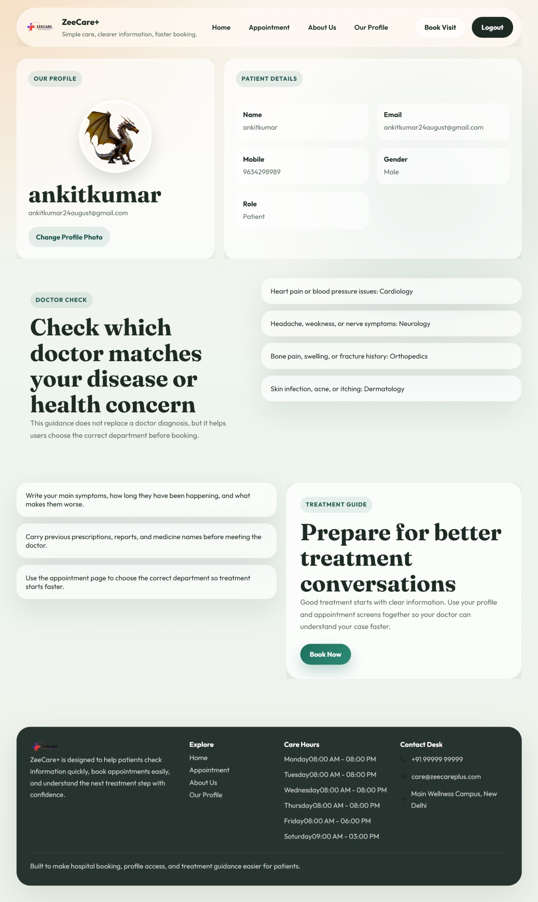

---

 
 
## 👨‍💻 Author

- Sumit Pal  
- GitHub: https://github.com/Sumit2344
 # 🏥 Hospital Management System (MERN Stack)

A full-stack web application designed to digitalize and simplify hospital operations. The system provides a centralized platform for managing patients, doctors, staff, and medical records with secure access and real-time updates.

---

## 📖 About the Project

This Hospital Management System helps manage patients, doctors, and appointments efficiently with a user-friendly interface.

---
## ⚙️ Installation

-git clone https://github.com/Sumit2344/Hospital-management-system-web.git
-cd Hospital-management-system-web
-npm install
-npm start
---
## 🎯 Objectives

- Simplify hospital operations  
- Improve patient-doctor communication  
- Provide secure data handling  

---
## ✨ Features

- User Authentication (Login/Register)  
- Book Appointments  
- Admin Dashboard  
- Doctor Management  
- Secure Payment Integration  

## 🔥 Key Highlights

- Full Stack MERN Project  
- Secure Authentication (JWT)  
- Real-time Appointment Booking  

---

## 🚀 Live Demo

🔗 Click here to view the project:  
👉 [Open Project](hospital-management-system-web-six.vercel.app)

---

## 📸 Project Preview

  

<b>📊 Dashboard</b>

---

  

<b>📅 Appointment</b>

---
 
